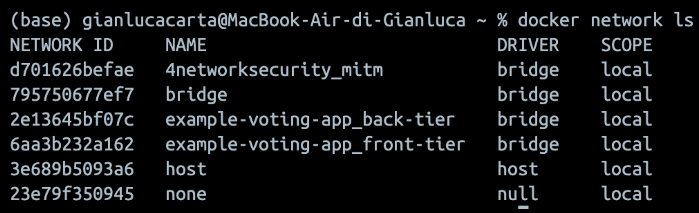
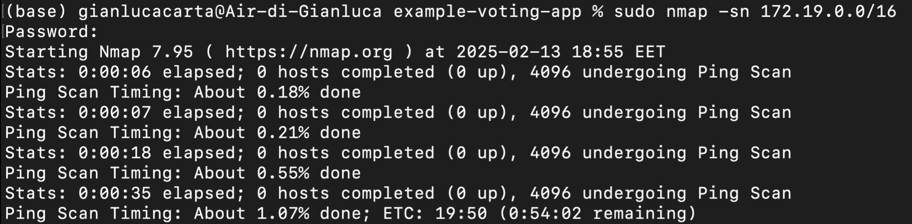
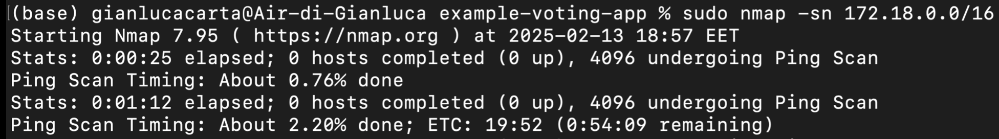
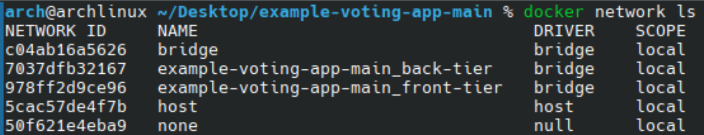
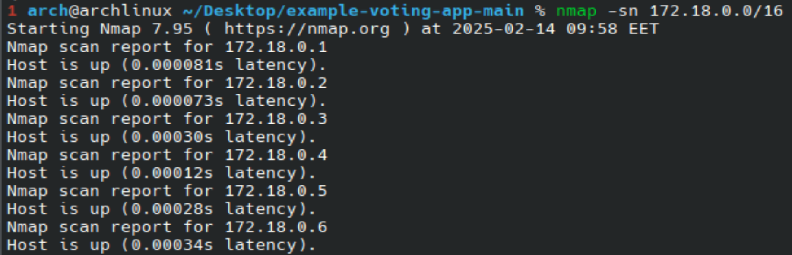
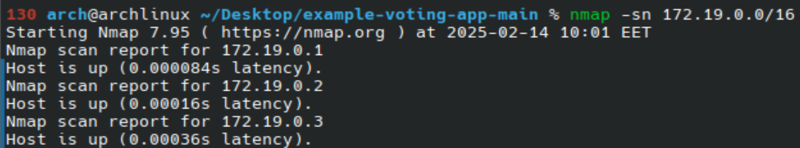
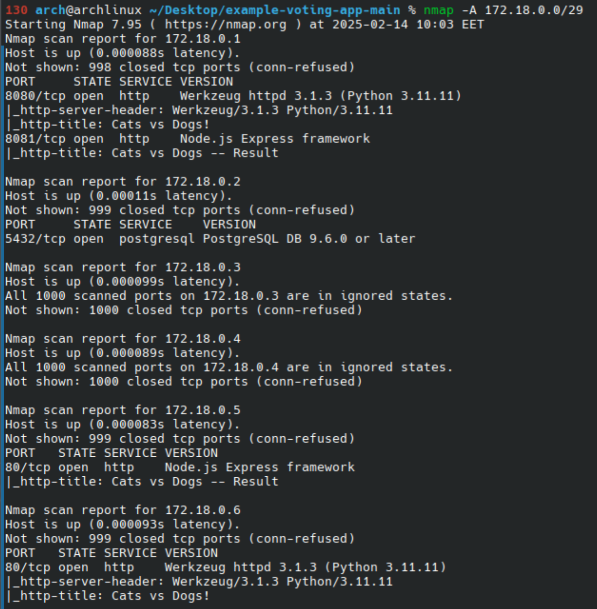
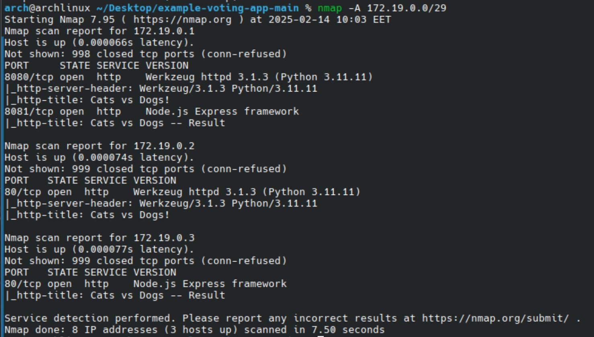
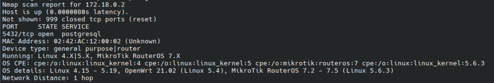
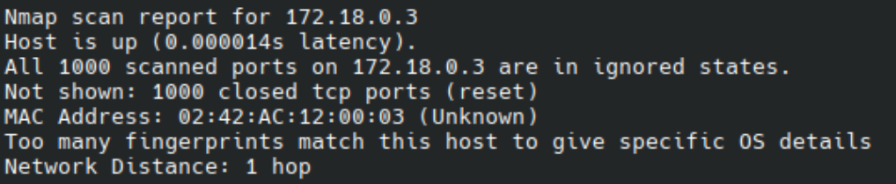

## Task 2

### Task 2 - on my laptop

By typing the suggested commands, I found the following:

```console
% docker network ls
```



```console
% ip addr
```

```
1: lo0: <UP,LOOPBACK,RUNNING,MULTICAST> mtu 16384 status UNKNOWN
    link/loopback 00:00:00:00:00:00 brd 00:00:00:00:00:00
    inet 127.0.0.1/8
    inet6 ::1/128
    inet6 fe80::1/64
2: gif0: <POINTOPOINT,MULTICAST> mtu 1280 status UNKNOWN
    link/none
3: stf0: <> mtu 1280 status UNKNOWN
    link/unknown
...
```


```console
% docker network inspect example-voting-app_back-tier
```
```
[
    {
        "Name": "example-voting-app_back-tier",
        ...
        "IPAM": {
            "Driver": "default",
            "Options": null,
            "Config": [
                {
                    "Subnet": "172.18.0.0/16",
                    "Gateway": "172.18.0.1"
                }
            ]
        },
        ...
        "Containers": {
            "060ba324f436398548b32bc2804b7575959d1473464359c9fbe264782d360c99": {
                "Name": "example-voting-app-worker-1",
                ...
                "MacAddress": "02:42:ac:12:00:05",
                "IPv4Address": "172.18.0.5/16",
            },
            "448059bdf426c863e6dceac5e4a3cd6a29b5a14701071d229370756602dd73a7": {
                "Name": "example-voting-app-vote-1",
                ...
                "MacAddress": "02:42:ac:12:00:04",
                "IPv4Address": "172.18.0.4/16",
            },
            "5bafeafea24b3ebecb6e59438d15e21885ab8b5885182f708b29a90e55788f0b": {
                "Name": "example-voting-app-result-1",
                ...
                "MacAddress": "02:42:ac:12:00:06",
                "IPv4Address": "172.18.0.6/16",
            },
            "7947cac470ec23db1f967b30d5d9058bee9b301f5fea592d9dafb788f0ae0790": {
                "Name": "example-voting-app-redis-1",
                ...
                "MacAddress": "02:42:ac:12:00:03",
                "IPv4Address": "172.18.0.3/16",
            },
            "f23855871b4bec2a14e466261b49c03add4f0db0f2a47bfcad8747c26fd5f823": {
                "Name": "example-voting-app-db-1",
                ...
                "MacAddress": "02:42:ac:12:00:02",
                "IPv4Address": "172.18.0.2/16",
            }
        },
        ...
        }
    }
]
```

```console
% docker network inspect example-voting-app_front-tier
```
```
[
    {
        "Name": "example-voting-app_front-tier",
        ...
        "IPAM": {
            "Driver": "default",
            "Options": null,
            "Config": [
                {
                    "Subnet": "172.19.0.0/16",
                    "Gateway": "172.19.0.1"
                }
            ]
        },
        "Internal": false,
        "Attachable": false,
        "Ingress": false,
        "ConfigFrom": {
            "Network": ""
        },
        "ConfigOnly": false,
        "Containers": {
            "448059bdf426c863e6dceac5e4a3cd6a29b5a14701071d229370756602dd73a7": {
                "Name": "example-voting-app-vote-1",
                "EndpointID": "a8b41243212b6c70cc1df07bbc749e08580d970bc5b1aadf5471b7a2b43aba0f",
                "MacAddress": "02:42:ac:13:00:02",
                "IPv4Address": "172.19.0.2/16",					<————————
                "IPv6Address": ""
            },
            "5bafeafea24b3ebecb6e59438d15e21885ab8b5885182f708b29a90e55788f0b": {
                "Name": "example-voting-app-result-1",
                "EndpointID": "3d4c56a87fdd6b3b5eedae626513c5fbacab286c3390a79d21c723c09c2e035e",
                "MacAddress": "02:42:ac:13:00:03",
                "IPv4Address": "172.19.0.3/16",
                "IPv6Address": ""
            }
        },
        ...
        }
    }
]
```

with `nmap -h` I find that I may use the List Scan (sL) or the Ping Scan (sn)

with them it seems to not work:




With the IP addresses found in the Intro section, i try with

`nmap -A 172.19.0.1` 

but get

```
Starting Nmap 7.95 ( https://nmap.org ) at 2025-02-13 19:03 EET
Problem binding to interface , errno: 42
socket_bindtodevice: Protocol not available
```

### Task 2 - in lab

Again, this time in the arch virtual machine, I type `docker network ls` and find



At this point, I try again with `% docker network inspect example-voting-app_front-tier` and `% docker network inspect example-voting-app_back-tier` and the results are the same as before.
The 172.18.0.0 and 172.19.0.0 addresses are the most important thing to remembre from these results.

#### Getting started with nmap

I use `nmap -sn 172.18.0.0/16` and  `nmap -sn 172.19.0.0/16` to find how many and which hosts are up




Then I use `nmap -A ...` to find about ports and services.
Since hosts that are up are in a limited range, I can use `/29` to save time




Finally, to find information about fingerprinting, I use `sudo nmap -O ...`




Accessing by browser, I can find that 172.19.0.2 and 172.19.0.3 are for voting: here is a page with the boxes for cats and dogs, while an error message occurs when trying to access other addresses.
