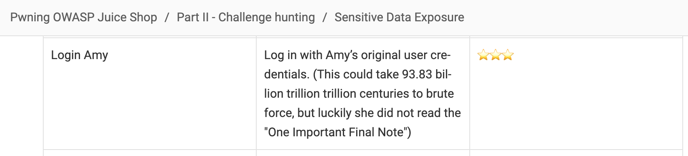
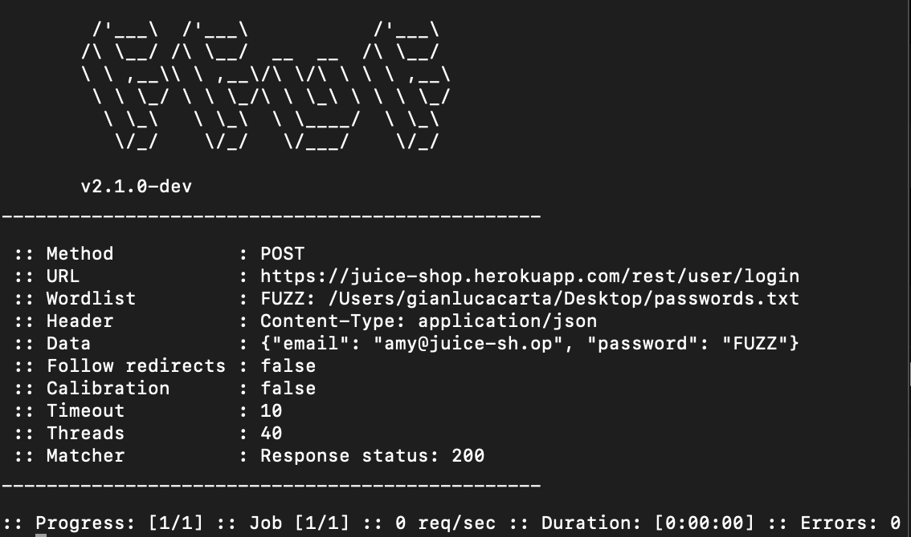
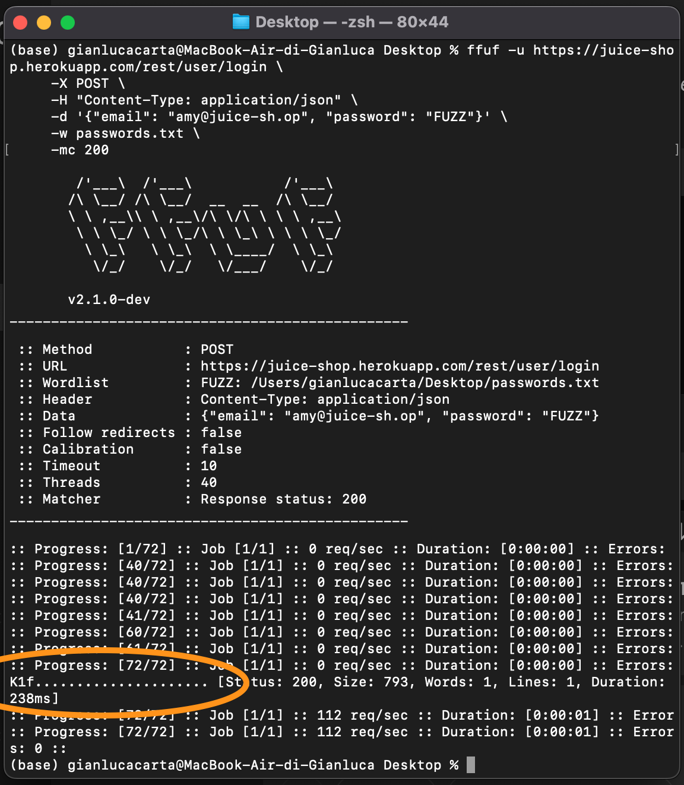

# Introduction to Cyber Security Testing, week 6

## Task 2

As suggested, I installed afl++ and enabled the address sanitizer by compiling sample.c with

```console
AFL_USE_ASAN=1 afl-cc -o sample sample.c
```

In the documentation I found

ASAN = Address SANitizer, finds memory corruption vulnerabilities like use-after-free, NULL pointer dereference, buffer overruns, etc.

Looking at the code in sample.c - thanks to the comment - it's easy to notice

```c
        fscanf(file, "%s", buffer); // Read one string from file into buffer, still potentially unsafe due to not using length checks
```

so, I expected to have a feedback from afl++ about this line.

### afl++ analysis

To start fuzzing I ran
```console
afl-fuzz -i inputs -o outputs -- ./sample @@
```

`inputs` and `outputs` are two folders I prepared: the first one with a `.txt` file containing just the word 'FUZZ', the second one empty.
`@@` is supposed to be replaced by the fuzzer with the generated fuzzed inputs.

After some minutes of running, I decided to stop when `state: running` became `state: finished`, as shown in the image below.

%20REPORT%20GENERALE.png)

Here we can see that at the moment of the screenshot
1. the strategy used was `havoc`
2. 1363 cycles had been completed 
3. only one crash was found

From https://afl-1.readthedocs.io/en/latest/user_guide.html:
1. havoc is a sort-of-fixed-length cycle with stacked random tweaks. The operations attempted during this stage include bit flips, overwrites with random and “interesting” integers, block deletion, block duplication, plus assorted dictionary-related operations (if a dictionary is supplied in the first place).
2. cycles_done = queue cycles completed so far.
A cycle is completed when all the execution paths have been explored at least once; in this case, the number of paths, indicated as `corpus count`, is two, coherently with what we expect from a .c program with just one `if` and one `else` corpuses.
3. The crash found can be seen into the `outputs` folder:
%20CRASHES%20FOLDER.png)
and once opened it's possible to see the fuzzed input that lead to it
.png)

It's possible to re-create the error with
```console
1 arch@archlinux ~/Desktop % ./sample outputs/default/crashes/id:000000,sig:06,src:000001,time:88,execs:85,op:havoc,rep:6
```

The response is
```console

=================================================================
==623289==ERROR: AddressSanitizer: stack-buffer-overflow on address 0x72a18e509052 at pc 0x5960ad7cc1a7 bp 0x7ffe04d340e0 sp 0x7ffe04d338a0
WRITE of size 51 at 0x72a18e509052 thread T0
    #0 0x5960ad7cc1a6 in scanf_common(void*, int, bool, char const*, __va_list_tag*) asan_interceptors.cpp.o
    #1 0x5960ad80c15f in __isoc99_vfscanf (/home/arch/Desktop/sample+0xe715f) (BuildId: f0ff8c43076caeb9b0ec84875e641de5f2352a39)
    #2 0x5960ad80c725 in __isoc99_fscanf (/home/arch/Desktop/sample+0xe7725) (BuildId: f0ff8c43076caeb9b0ec84875e641de5f2352a39)
    #3 0x5960ad885d53 in main /home/arch/Desktop/sample.c:16:9
    #4 0x72a190433e07  (/usr/lib/libc.so.6+0x25e07) (BuildId: 98b3d8e0b8c534c769cb871c438b4f8f3a8e4bf3)
    #5 0x72a190433ecb in __libc_start_main (/usr/lib/libc.so.6+0x25ecb) (BuildId: 98b3d8e0b8c534c769cb871c438b4f8f3a8e4bf3)
    #6 0x5960ad751174 in _start (/home/arch/Desktop/sample+0x2c174) (BuildId: f0ff8c43076caeb9b0ec84875e641de5f2352a39)

Address 0x72a18e509052 is located in stack of thread T0 at offset 82 in frame
    #0 0x5960ad885bef in main /home/arch/Desktop/sample.c:5

  This frame has 1 object(s):
    [32, 82) 'buffer' (line 6) <== Memory access at offset 82 overflows this variable
HINT: this may be a false positive if your program uses some custom stack unwind mechanism, swapcontext or vfork
      (longjmp and C++ exceptions *are* supported)
SUMMARY: AddressSanitizer: stack-buffer-overflow asan_interceptors.cpp.o in scanf_common(void*, int, bool, char const*, __va_list_tag*)
Shadow bytes around the buggy address:
  0x72a18e508d80: 00 00 00 00 00 00 00 00 00 00 00 00 00 00 00 00
  0x72a18e508e00: 00 00 00 00 00 00 00 00 00 00 00 00 00 00 00 00
  0x72a18e508e80: 00 00 00 00 00 00 00 00 00 00 00 00 00 00 00 00
  0x72a18e508f00: 00 00 00 00 00 00 00 00 00 00 00 00 00 00 00 00
  0x72a18e508f80: 00 00 00 00 00 00 00 00 00 00 00 00 00 00 00 00
=>0x72a18e509000: f1 f1 f1 f1 00 00 00 00 00 00[02]f3 f3 f3 f3 f3
  0x72a18e509080: 00 00 00 00 00 00 00 00 00 00 00 00 00 00 00 00
  0x72a18e509100: 00 00 00 00 00 00 00 00 00 00 00 00 00 00 00 00
  0x72a18e509180: 00 00 00 00 00 00 00 00 00 00 00 00 00 00 00 00
  0x72a18e509200: 00 00 00 00 00 00 00 00 00 00 00 00 00 00 00 00
  0x72a18e509280: 00 00 00 00 00 00 00 00 00 00 00 00 00 00 00 00
Shadow byte legend (one shadow byte represents 8 application bytes):
  Addressable:           00
  Partially addressable: 01 02 03 04 05 06 07
  Heap left redzone:       fa
  Freed heap region:       fd
  Stack left redzone:      f1
  Stack mid redzone:       f2
  Stack right redzone:     f3
  Stack after return:      f5
  Stack use after scope:   f8
  Global redzone:          f9
  Global init order:       f6
  Poisoned by user:        f7
  Container overflow:      fc
  Array cookie:            ac
  Intra object redzone:    bb
  ASan internal:           fe
  Left alloca redzone:     ca
  Right alloca redzone:    cb
==623289==ABORTING

```

The most important line is
```console
    #3 0x5960ad885d53 in main /home/arch/Desktop/sample.c:16:9
```
From this, we can understand that a buffer overflow was caused by writing 51 bytes to a buffer that is too small. The problem is in main() in sample.c, specifically at line 16

After fixing it, for example with
```c
fscanf(file, "%49s", buffer);
```
re-running the whole process we find a new output folder where the crash sub-folder is empty.
And most important, the report looks like this:

.png)

with
```console
saved crashes : 0
```


## Task 3

The challenge I chose is "Log in with Amy’s original user credentials"



My idea was to generate a list of possible passwords and then try them in an authomatic way using ffuf.

To build a useful command I ran
``` console
ffuf -h
```

and with the help of LLMs I found, among all the commands:
``` console
  -X                  HTTP method to use
  -H                  Header `"Name: Value"`, separated by colon. Multiple -H flags are accepted.
  -d                  POST data
  -u                  Target URL
  -mc                 Match HTTP status codes, or "all" for everything. (default: 200-299,301,302,307,401,403,405,500)
  -w                  Wordlist file path and (optional) keyword separated by colon. eg. '/path/to/wordlist:KEYWORD'
```

So, I created the command:

``` console
ffuf -u https://juice-shop.herokuapp.com/rest/user/login \
     -X POST \
     -H "Content-Type: application/json" \
     -d '{"email": "amy@juice-sh.op", "password": "FUZZ"}' \
     -w passwords.txt \
     -mc 200
```

with 'passwords.txt' being empty at the beginning.

The email was chosen after looking on the web for typical usernames in OWASP Juice Shop.

I filled the passwords file according to the expanded description of the challenge:
by googling "93.83 billion trillion trillion centuries" the first link to be returned is https://www.grc.com/haystack.htm?id
Considering that Amy "did not put nearly enough effort and creativity into the password selection process" I tried with the example password 'D0g.....................'



Of course, the One important final note cited this passwords as an example to not use, but also suggested to invent a padding policy:
making the hypothesis that Amy did not, I filled passwords.txt with words and dots, changing letters with digits.
For example, I used 4my instead of Amy.
But I could find the solution only when I used her husband's name (Kif --> K1f).
With a version of passwords.txt with some '4amy...' and 'K1f...' passwords, I could obtain a positive answer by ffuf:



